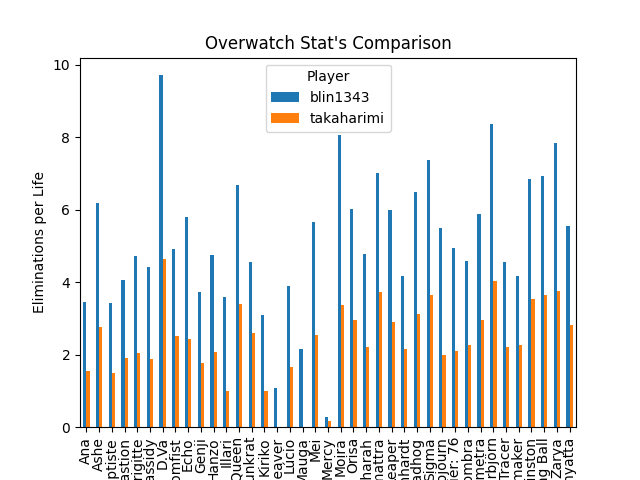

# Overwatch Statistics Comparison Application

This application extracts data of the players of the game Overwatch and compares the statistics between them.

## Installing
```
git clone git@github.com:svwoodhouse/OverwatchMetricsApplication.git
cd ./OverwatchMetricsApplication
python webscraper.py
```
## Executing Overwatch Metrics Application
Upon exectution of the code, the code grabs the player's information using the request library. 
```python
url = "https://playoverwatch.com/en-us/career/pc/takaharimi-1252"
page = requests.get(url, headers=header)
soup = bs(page.content, "html.parser")
```

 Used Beautiful Soup to filter out the HTMLL content that was given during the request for the player's statistical data.
 Sends the data to a text file and formats it to csv for data processing. 
 ```python
   def getStats(optionID, soup):
      getMainDiv = soup.findAll("div",{"class":"Profile-heroSummary--view quickPlay-view is-active"})
      for dataCatagoryDiv in getMainDiv: 
         getDataCatagoryDiv = dataCatagoryDiv.findAll("div",{"data-category-id":optionID})
         for characters in getDataCatagoryDiv:
            characterName = characters.findAll("div", {"class": "Profile-progressBar-title"})
            characterStat = characters.findAll("div", {"class": "Profile-progressBar-description"})
            for c, d in zip(characterName, characterStat):
               if ":" not in d.get_text() and "%" not in d.get_text():
                  name = c.get_text()
                  stat= d.get_text()
                  data.append({"name":name, "title": dataCatagoryID.get(optionID), "stat": stat})

   def gatherStats(data, playerName):
      for i in data:
         characterDataFile.write(i["name"] + "," + i["title"] + "," + i['stat'] + "," + playerName + "\n")
```

Used pandas to create a dataframe from the csv file. Extracts the data in the dataframe that shows the total amount of medals each user earned using the character Zenyatta. Displays the data via a bar chart.
```python
data=pd.read_csv("characterData.txt",sep=",", encoding ='unicode_escape', names=["Hero","Category", "Stat", "Player"])

# bar chart for each character and each category compare the players
data = data[data["Category"].isin(["Eliminations per Life"])]
metric = data["Category"].unique()[0]

df = data.pivot_table(index='Hero',
                  columns='Player', 
                  values='Stat', 
                  fill_value=0, 
                  aggfunc='sum').reset_index()

df.plot(x="Hero", y=[df.columns[1], df.columns[2]], kind="bar") 
plt.xlabel('Hero')  
plt.ylabel(f"{metric}")  
plt.title("Overwatch Stat's Comparison") 
plt.show()
```

## Example: Eliminations per Life



## Built With
* [BeautifulSoup](https://www.crummy.com/software/BeautifulSoup/bs4/doc/) - Python library used for pulling data from HTML and XML files.
* [requests](https://pypi.org/project/requests/2.7.0/) - Python library used to send HTTP requests. 
* [pandas](https://pandas.pydata.org/) - Python open-source library used for data analysis. 
